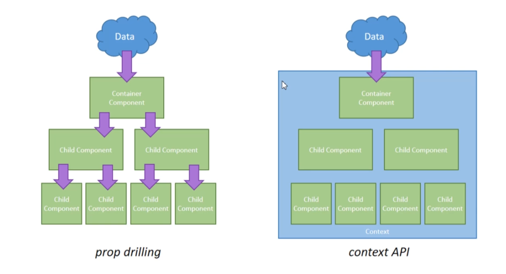

<h1 align="center">ReactJS Lecture Notes</h1>

<p align="center">
  
</p>

# React Nedir?

React bir JavaScript kütüphanesi olup web uygulamaları için hızlı ve interaktif kullanıcı arayüzleri oluşturmada kullanılır.

Açık kaynak kodlu, bileşen bazlı ve front-end bir kütüphane olan React, sadece uygulamanın görünüm katmanından sorumludur.

React, Jordan Walke adında Facebook’ta çalışan bir yazılım mühendisi tarafından geliştirilmiştir.

# JSX ve Component

JSX, JavaScript ve XML kelimelerinin baş harflerinden elde edilen akronim bir kelimedir. JSX 'in temel kullanım amacı, javascript dosyalarının içinde HTML kodu yazarak daha görsel bir kod kullanımı sağlamaktır.

>#### Not: JSX geriye yanlızca 1 tane parent element döndürebilir.!
*Yanlış*:
```jsx
  return (
    <div className="App">
      <h1>Hello World! JSX and Component</h1>
    </div>
    <h2>Hello World! 2</h2>
  );
```
*Doğru*:
```jsx
  return (
    <div className="App">
      <h1>Hello World! JSX and Component</h1>
      <h2>Hello World! 2</h2>
    </div>
  );
```

#### **JSX içerisinde normal HTML özellikleri syntax olarak farklı..**
*Örnek*:
```jsx
<div class="div">Div</div> // Hata verir.
<div className="div">Div</div> // JSX için doğru syntax.
```

#### ***JSX ifadeleri içerisinde javascript ifadeleri kullanımı.***
*Örnek*:
```jsx
function App() { // {} içerisine javascript ifademizi yazıyoruz.
  const test = 33;
  const isAuth = true;
  return (
    <div className="App">
      <h1>Hello World! JSX and Component</h1>
      {1+1}
      <h2>{"Hello".toUpperCase()}</h2>
      <h2>{test}</h2>
      <div>
        {
          isAuth ? <p>Kullanıcı doğrulandı!</p> : null //<p>Kullanıcı Doğrulanamadı!</p>
        }
      </div>
    </div>
  );
}
```

## **Component nedir?**

Componentler, uygulamanızı tekrar kullan  ılabilir parçalara ayırmanıza ve her bir parçayı ayrı ayrı düşünmenize izin verir. Bu bir buton, bir form, bir diyalog, bir ekran vb. gibi olabilir. 2 tür component vardır. Bunlar fonksiyon component ve class componenttır.

### *Örnek bir component yapısı*: (Class-Based Component)
```jsx
import React, { Component } from 'react'

class User extends Component { // Component yapısı miras alıyoruz.
    render() { // component yapımızı işlemek için fonksiyonumuz.
        return ( // JSX yapımızı geriye döndüyoruz.
            <div>
                <form>
                    <input type="text"></input>
                    <button>Gönder</button>
                </form>
            </div>
        )
    }
}

export default User; // Component sınıfından miras alınmış yeni bir 'User' component (class) yapımızı dışarıya aktarıyoruz. 
```

### *Örnek bir component yapısı*: (Function-Based Component)
```jsx
import React from 'react';

function Navbar(){ //Eğer component yapımız sabit bir yapı olacaksa yani herhangi bir state barındırmayacak ise "function-based" component yapısı kullanmamız çok daha sağlıklı olur.
    return (
        <div>
            <h3>User App</h3>
        </div>
    )
}

export default Navbar
```

### Örnek bir stil ekleme işlemi:
```jsx
    return ( 
      // stil yapımızı yine HTML içerisindeki gibi fakat '=' ifadesinden sonra '{{}}' yapısının içerisine yazıyoruz aşağıda görüldüğü gibi.. 
      //'{{}}' ve bu yapımızın ismine "Embedding Expressions" diyoruz.
      <div>
        <h1 style={{color: "red", fontSize: "32px"}}>App Component</h1>
      </div>
    );
```

# Props

## **Props nedir?**
"props" yapısı bizim verilerimizi tek bir obje olarak bir component'den diğer component'e aktarılmasını sağlar.

### **Örnek props kullanımı:**
```jsx
//App.js
<Navbar title="User App"/> 
//buradaki "Navbar" bir component. "title" kısmı bizim anahtar kelimemiz (key) "User App" ise verimiz (value)
//verimizi diğer component yapımıza aktardığımıza göre şimdi birde nasıl kullanıldığına bakalım.

//Navbar.js
function Navbar(props){
    return ( // gördüğünüz gibi props yapımızı bir parametre olarak aldık.
        <div>
            <h3>Props içerisindeki title değerimiz: {props.title}</h3>
        </div>
    )
}
```

## **Default props ve PropTypes**
* propTypes - Verinin tipini ve gereklimi gereksizmi olduğunu belirtmek için kullanılıyor.
* defaultProps - Verilerin varsayılan değerlerini ayarlamak için kullanılıyor.
```jsx
import React from 'react';
import PropTypes from 'prop-types';

function Navbar(props){
    return (
        <div>
            <h3>Props içerisindeki title değerimiz: {props.title}</h3>
        </div>
    )
}

Navbar.propTypes = { //title değerimizin gerekliliğini yani zorunluluğunu belirttik.
    title: PropTypes.string.isRequired
}

Navbar.defaultProps  = { //title değerimizin varsayılan değerini belirttik.
    title: "Default App"
}
export default Navbar
```

# State

## **State nedir?**
JavaScript’te bir değer saklayacağımız zaman nasıl ki değişken oluşturmak için var-let-const tanımlamalarından yararlanıyorsak, React componentlerinde de değer saklamak için state’ten yararlanırız.

Bir butona tıkladıktan sonra bir değeri güncellemek için, kullanıcı tarafından girilmiş bir input değerini saklamak için veya bir servisten dönen sonucu depolamak/kaydetmek gibi birçok farklı durumda state’i kullanılabiliriz.

## **State Oluşturma:**
```jsx
class User extends Component {

  //  state oluşturma 1.yöntem
  // constructor(props){ // Ask google "what is javascript constructor"
  //     super(props);
  //     this.state = {
  //       title: "State"
  //     }
  // }

  // state oluşturma 2.yöntem
  // her iki seçenekte kullanılabilir.
  state = {
      title: "State"
  }

  render() {
      const { title } = this.state;
      return ( 
          <div className="col-md-8 mb-4">
          <h1>Hello {title}!</h1>
          </div>
      )
  }
}
export default User;
```

## **Example Events:**
```jsx
class User extends Component {
  onClickEvent(e){ //event içerisinden gelen parametremiz
    console.log(e) //buradan neler geldiğini görebiliriz.
    console.log("Clicked!")
  }

  render() {
      return ( 
          <div className="col-md-8 mb-4">
            <h1>Hello Event!</h1>
            <button onClick={this.onClickEvent}></button>
          </div>
      )
  }
}
export default User;
```

## **Event ile State değiştirme:**
```jsx
class User extends Component {
  state = {
      isVisible: false
  }

  onClickEvent = (e) => { 
    // arrow function kullandığımız için ayrıca bir bind() yazmamız gerekmiyor. 
    // Normal fonksiyon ile arrow fonksiyon arasındaki önemli ve ince bir ayrıntıdır bu..
    this.setState({
        isVisible: !this.state.isVisible
    })
  }

  render() {
      const { isVisible } = this.state;
      return ( 
          <div className="col-md-8 mb-4">
            <div className="card" onClick={this.onClickEvent}>
              <div className="card-header d-flex justify-content-between">
                <h4 className="d-inline">Açılır kapanır menü</h4>
              </div>
                {
                  isVisible ? <h2>Hello!</h2> : null
                }
              </div>
          </div>
      )}
}
export default User;
```
> **Not**: Binding konusu çok önemli bir rol oynuyor yukarıdaki "this" kısmında.

# State Managment (ContextAPI)

## Sorun 🔧
React, Context API ile prop drilling denen sorunun önüne geçmeyi amaçlanmaktadır.

## Prop Drilling Nedir ?
Prop drilling, bir state’in, component ağacımızın daha yukarısında bulunan bir parent component’ten, component ağacımızın altlarında bulunan bir child component’e props yoluyla aktarılarak state’in ulaştırılmasına denir. Buradaki sorun, state yukarıdan aşağıya doğru aktarılırken, arada köprü olarak kullandığımız componentlerin sadece bu değeri ulaştırmak için gereksiz yere kullanılıyor olmasıdır.

## Context API Nedir?
Aktarılmak istenen değerleri global şekilde tutar ve direkt olarak kullanılması gereken component’e aktarılmasını sağlar. Böylelikle bir state’i, component ağacının altlarında bulunan bir component’e aktarmak istediğiniz zaman, her seferinde props olarak göndermenize gerek kalmaz.



> **Props** - *"Ufak ölçekli" uygulamalarda kullanılabilir.*

> **Context API** - *"Orta ölçekli" uygulamalarda kullanılabilir.*

> **Redux** - *"Büyük ölçekli" uygulamalarda kullanılabilir.*

### Context API Kavramları:
* Provider - Üretici
* Consumer - Tüketici


#### Önemli bağlantılar:
- [**JSX Emmet support | Medium**](https://medium.com/@eshwaren/enable-emmet-support-for-jsx-in-visual-studio-code-react-f1f5dfe8809c)
- [**React Simple Animation Library | React-Pose**](https://popmotion.io/pose/learn/get-started/)
- [**React Uniq ID Generator Library**](https://www.npmjs.com/package/uniqid)

